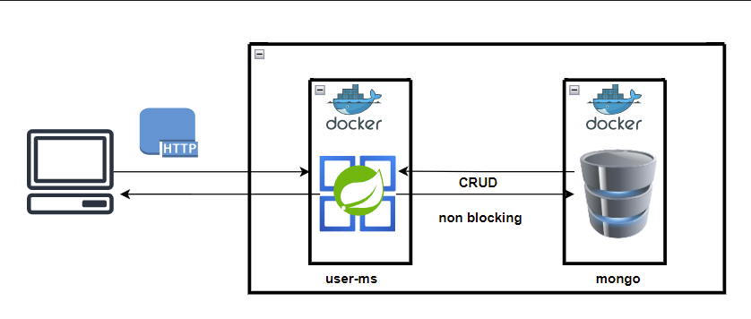

# User-ms

User ms is a Spring Boot 3 application that performs CRUD operations over a mongo db.


## Installation

For successful installation JDK 17, Docker & Docker compose are required.

In the project root directory  **poc-project** execute buidAndDeploy.sh
This script builds the application, runs integration tests, creates docker images and finally
spins up the dockerized microservices.

```bash
./buildAndDeploy.sh
```

## Configuration
The majority of the configuration resides inside the docker-compose.yml (located on project root folder) and some 
application specif parameters can be configured on application.yml resource of each service.


## Usage
After successful deployment of all microservices you can check the OpenApi documentation 
and try the API operations.

User API can be accessed here: http://localhost:9080/webjars/swagger-ui/index.html

All services run locally on the host network so port collision might occur if a port is already 
used on the host machine. Please check docker-compose.yml for more details on ports used.

No stress testing nor a frontend has been implemented for this project.

## Design and Architecture



User service is backed by a mongoDB as persistent storage and all interactions with the DB have been implemented
in a non-blocking  reactive way, leveraging Flux and Mono publishers.

Regarding testing, Integration tests have been implemented for the user service API by using
Junit5, a mongoDB testcontainer (same version as the one used by the app) and a reactive WebTestClient.

